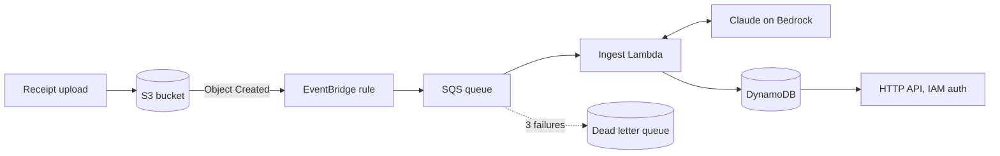

# Docket

Docket turns a receipt into clean, checked data.

Drop a PDF or a photo of a receipt into an S3 bucket. A few seconds later the
store name, the date, every line item, and the total are in DynamoDB as
structured JSON. Nothing is saved unless it passes a strict format check first.

It is a small event driven pipeline on AWS, written in TypeScript with the CDK.

## Why it exists

Language models are good at reading receipts. They are not good at being
trusted. A model will happily return a total of `$12.99` as a string, invent a
field it could not find, or drop a line item and never mention it.

So the extraction is not the interesting part of this project. Everything around
it is:

- a schema gate that refuses bad output instead of saving it
- ids derived from content, so a retry cannot create a duplicate
- a split between bad data and broken infrastructure, so alarms mean something
- an evaluation harness that measures accuracy rather than assuming it

## Architecture



1. A receipt lands in S3. Only `.pdf`, `.jpg`, `.jpeg`, `.png`, and `.webp`
   uploads go any further.
2. S3 tells EventBridge. A rule filters on the file type and puts a message on
   an SQS queue.
3. The ingest Lambda reads the object. A PDF is read as text. A photo is sent to
   the model as an image.
4. Claude on Bedrock returns JSON. The JSON is checked against a strict schema.
   If it fails, the model gets exactly one chance to fix it, with the errors
   handed back to it.
5. A result that passes is written to DynamoDB. A result that fails is recorded
   as `FAILED` with the reason. It is never saved as if it were fine.
6. A read API serves one document or a list by status.

## Try it without an AWS account

The demo runs the real extraction code on your machine, using saved model
responses, so it needs no internet and no account.

```bash
npm install
npm run demo
# open http://localhost:5173
```

You get 42 sample receipts, four scenarios that show what the pipeline handles,
and the full accuracy report. To analyze your own receipt, set
`ANTHROPIC_API_KEY` and restart. Then a PDF or a photo you upload runs through
the same pipeline for real.

There is also a static build with everything baked in, for hosting with no
backend:

```bash
npm run demo:static   # writes demo/static
```

## What the pipeline gets right

Four decisions are worth reading about, because in each case the obvious choice
is the wrong one. They are written up in
[docs/decisions.md](docs/decisions.md):

- **Document ids come from content, not from a counter.** SQS delivers at least
  once, so a generated id means duplicates.
- **Bad data becomes `FAILED`. Only broken infrastructure reaches the dead letter
  queue.** Retrying a corrupt PDF three times helps nobody, and it turns the DLQ
  alarm into noise.
- **S3 fires through EventBridge, not a direct bucket notification.** Filtering
  belongs in infrastructure, and EventBridge does not mangle the object key.
- **Every model response is schema checked, with exactly one repair attempt.**
  Zero repairs throws away good calls. Unlimited repairs throws away money.

## Tests

```bash
npm test              # 84 tests: handlers, schema, scoring, providers, and the stack
npm run eval          # scores 42 receipts, fails under 0.90
npm run synth         # CloudFormation, with cdk-nag best practice checks
npm run lint
```

The stack itself is tested. `test/stack.test.ts` asserts what the design
promises: the dead letter queue trips after three tries, every bucket blocks
public access and refuses plain HTTP, Bedrock access is limited to the Anthropic
model family instead of every model, the table has point in time recovery on,
and the event rule routes only receipt uploads. It also pins the logical ids of
the table, the buckets, and the rule, because renaming one of those in
CloudFormation means delete and recreate.

`cdk-nag` runs during `npm run synth`, so an AWS best practice violation fails
the build the same way a failing test does. Anything accepted on purpose is
suppressed one finding at a time with a written reason, in
`lib/nag-suppressions.ts`.

There is also an end to end test against LocalStack. It puts a real object in a
real S3 bucket, runs the handler against a real DynamoDB table, and checks that a
redelivered message is skipped rather than processed twice. It needs Docker:

```bash
docker compose -f docker-compose.localstack.yml up -d
npm run test:integration
docker compose -f docker-compose.localstack.yml down
```

## Accuracy

Extraction is scored field by field against a labeled set of 42 receipts. Thirty
are ordinary. Twelve are deliberately hard: other currencies, discount lines that
go negative, a missing subtotal, foreign VAT wording, dates in odd formats, and a
tip that makes the total not add up.

The current score is **0.968**, and CI fails below 0.90.

Read [eval/README.md](eval/README.md) before quoting that number. It is produced
by replaying saved responses that stand in for a model, so it measures the
harness and the prompt structure, not live model accuracy.

## Deploy

```bash
npx cdk bootstrap aws://<account>/us-east-1
npx cdk deploy DocketCicd                    # GitHub OIDC provider and deploy role
npx cdk deploy Docket --context docket:alarmEmail=you@example.com
```

The pipeline runs Claude Haiku on Bedrock. Serverless models enable themselves the
first time you invoke one, so there is nothing to switch on, but a first time
Anthropic user may be asked to submit use case details before the first call
succeeds. Do that before deploying, not during.

CI deploys on merge to `main` using a role assumed through GitHub OIDC. There are
no long lived AWS keys anywhere in this repo.

## Running it

[RUNBOOK.md](RUNBOOK.md) has one entry per alarm, with the first three commands
to run and what to do next. When a message ends up in the dead letter queue,
`npm run redrive` moves it back once the cause is fixed.

[docs/data-handling.md](docs/data-handling.md) covers what is stored, for how
long, and how card numbers, emails, and phone numbers are scrubbed before
anything is written.

## Status

The code is complete and verified locally. It has never been deployed to a live
AWS account, so no number here comes from production.

What is actually verified: TypeScript compiles clean, the linter passes, 84 tests
pass, `cdk synth` produces valid CloudFormation with zero cdk-nag findings, and
the LocalStack test exercises the real S3 and DynamoDB behavior. The accuracy
number and the cost estimate come from saved synthetic responses, not from
Bedrock.

## License

MIT. See [LICENSE](LICENSE).
