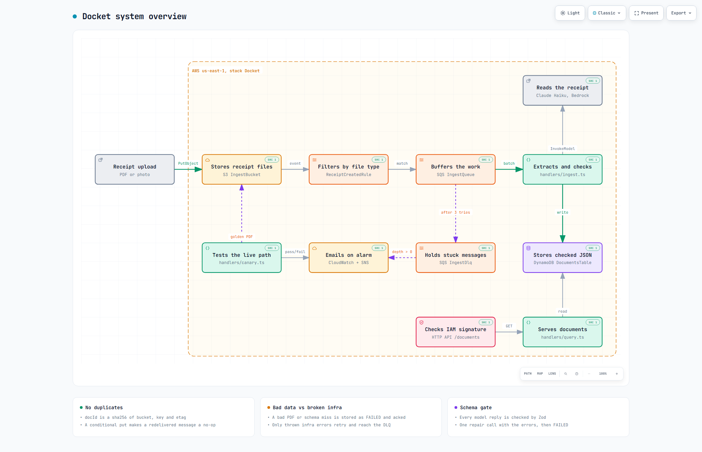
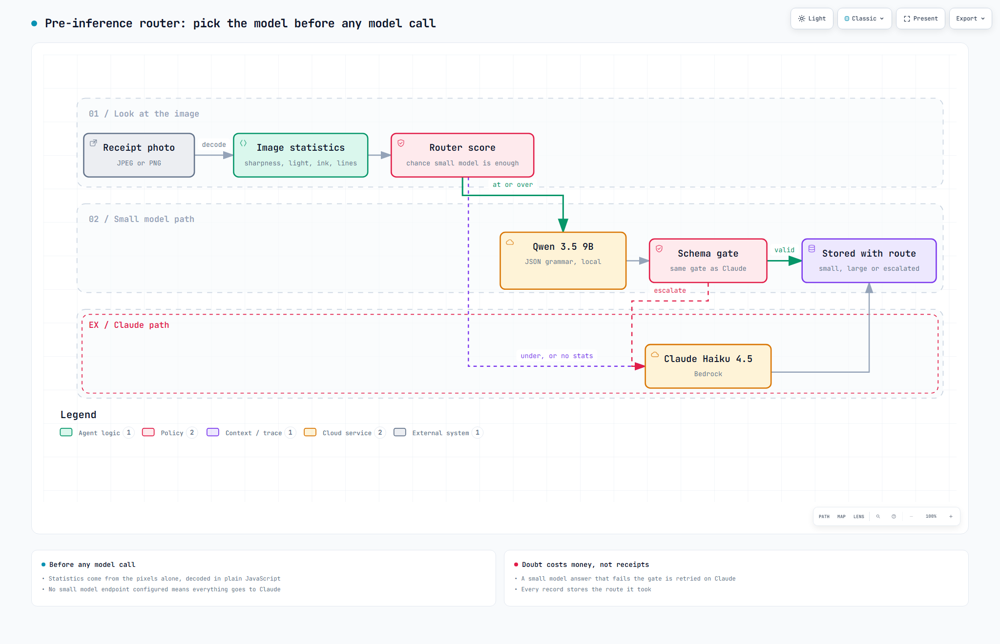
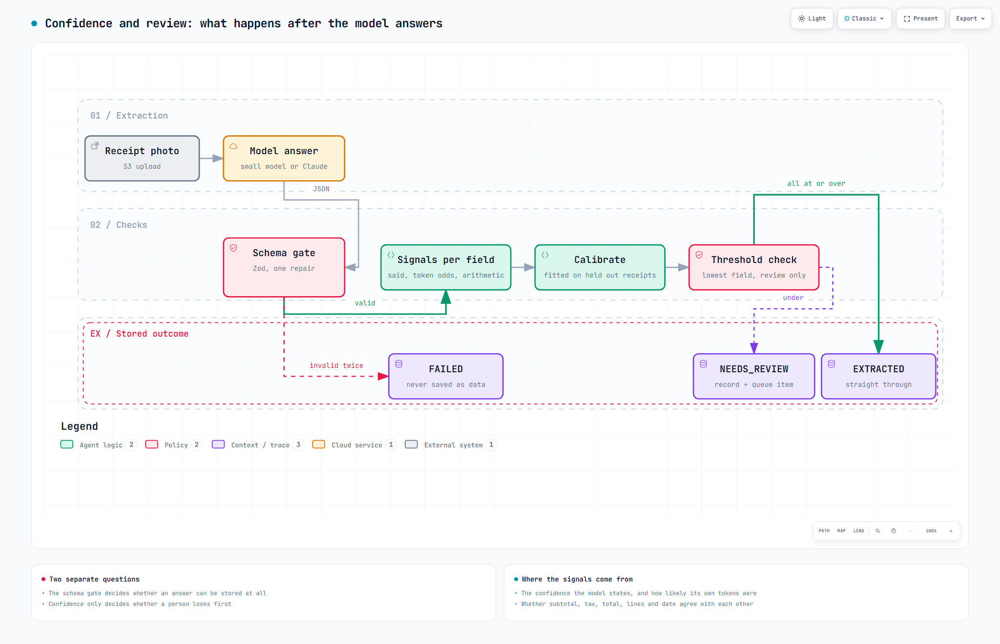
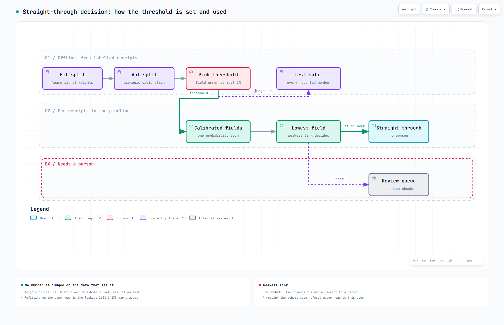

# Docket

Docket reads a photo or PDF of a receipt and turns it into clean, checked data. It refuses to save anything that fails a strict format check, because a model will happily invent a field, and a retry can never create a duplicate. Every field also gets a confidence score, and a receipt goes to a person whenever one of its fields looks doubtful.

**[Open the demo](https://samad-zeeshan.github.io/Docket/)**. It replays recorded results: no login, no waiting, no model behind it. A 90 second walkthrough is in [docs/demo.mp4](docs/demo.mp4).


## How it works


A receipt put in S3 goes through EventBridge and SQS to a Lambda that reads it with a model and writes the result to DynamoDB.


Before any model call, the router looks at the photo and picks a small local model or Claude on Bedrock.


The schema gate decides whether an answer can be stored. Confidence only decides whether a person looks first.


The threshold is set on one group of receipts and judged on another, and the least confident field decides. The upload flow, document states and deployment are in `docs/diagrams/` too, each with an interactive version.

## Data

<!-- results:data -->
| Set | Receipts read | Fields scored | Licence |
| --- | ---: | ---: | ---: |
| SROIE (Malaysia, scans) | 446 | merchant, date, total | CC BY 4.0 per the mirror |
| CORD v2 (Indonesia, photos) | 160 | line items, subtotal, tax, total | CC BY 4.0 |

The small model read 606 of the 1,987 downloaded receipts before its time budget ran out, 149 of them in the test split.
<!-- /results -->

The run stopped at a time limit because the GPU is shared. The order was fixed first (SROIE, then CORD), so results did not pick the cut, and it falls short of the thousand receipts planned. SROIE company, date and total map to merchant, date and total. CORD menu lines, subtotal, tax and total map to the same fields. Neither set labels currency, so it is not scored, and no field is scored where a set does not label it. `npm run data:fetch` downloads both against pinned sha256 sums. The repo keeps only ids, splits and image hashes, plus three CORD images for the demo.

## Straight-through processing

<!-- results:stp -->
| Field error budget | Threshold (from val) | Straight through (test) | Field error (test) | Same rule on stated confidence | Highest ladder rung held |
| --- | ---: | ---: | ---: | ---: | ---: |
| 1.0% | 0.94 | 7.4% | 0.0% | 0.0% | fit-val split |
| 5.0% | 0.88 | 18.1% | 3.9% | 0.0% | fit-val split |
| 10.0% | 0.61 | 46.3% | 6.5% | 0.0% | fit-val split |

At a 1.0% field error budget, 11 of 149 test receipts (7.4%) pass with no person, and 0 of their 32 fields are wrong. Thresholds were picked on 161 validation receipts. By set that is 11 SROIE and 0 CORD receipts. Judged on all six fields at once, as the pipeline does today, no threshold meets any of the 3 budgets, so the pipeline sends every small model receipt to a person.
<!-- /results -->

The table judges each receipt on the fields calibrated for its set, which assumes the document type is known. The pipeline does not know it yet. On the confidence the model writes down, no threshold met any budget. The fit and val rung of the validity ladder (arXiv 2608.14639) holds, which bounds error on average and certifies nothing. The exact binomial rungs certify nothing yet because the validation split is small.

<!-- results:calibration -->
| Field | Test fields | Right | ECE stated | ECE calibrated | AUROC stated | AUROC calibrated |
| --- | ---: | ---: | ---: | ---: | ---: | ---: |
| merchant | 111 | 74.8% | 0.217 | 0.177 | 0.606 | 0.771 |
| date | 104 | 93.3% | 0.045 | 0.047 | 0.543 | 0.802 |
| total | 146 | 88.4% | 0.105 | 0.069 | 0.343 | 0.772 |
| subtotal | 37 | 54.0% | 0.440 | 0.060 | 0.338 | 0.612 |
| tax | 37 | 21.6% | 0.611 | 0.127 | 0.830 | 0.914 |
| line items | 36 | 44.4% | 0.477 | 0.216 | 0.613 | 0.564 |
<!-- /results -->

ECE is the average gap between stated confidence and how often a field is right. Calibration helps most on subtotal and tax, where the model said it was sure and was often wrong. Date does not improve, and line items rank worse after calibration, so line items are the weakest part of the decision.

## Routing and cost

<!-- results:routing -->
| Path | Receipts | Valid first try | Valid after repair | Field accuracy |
| --- | ---: | ---: | ---: | ---: |
| Claude Haiku 4.5, hand checked text | 42 | 100.0% | 100.0% | 0.999 |
| Qwen 3.5 9B with grammar, hand checked text | 42 | 100.0% | 100.0% | 0.984 |
| Qwen 3.5 9B without grammar, hand checked text | 42 | 100.0% | 100.0% | 0.987 |
| Qwen 3.5 9B with grammar, public photos | 20 | 100.0% | 100.0% | 0.909 |
| Qwen 3.5 9B without grammar, public photos | 20 | 85.0% | 85.0% | 0.559 |

Without the grammar, 3 of 20 photo answers never became valid JSON. On the test split the small model got every field right on 55.0% of receipts. The router predicts that with 64.4% accuracy and sends 43.6% to the small model, where field error is 10.0% against 35.9% on the rest. Claude on every photo would cost an estimated $2.32 per 1,000 receipts, $1.31 with the router.
<!-- /results -->

The small model is Qwen 3.5 9B on a local GPU. Claude Haiku 4.5 ran only on the hand checked receipts, from saved Bedrock responses. There were no Bedrock credentials for the public sets, so Claude on public photos is not run and its cost there is an estimate from the published image token rule. The router beats a coin but not by much, the warning in arXiv 2608.06607: routing pays only when the cheap model's failures show in the image.

## Robustness

<!-- results:robustness -->
On 4 receipts, field accuracy is 0.667 clean and, at the worst level of each damage, blur 0.071, rotation 0.786, crop 0.857, darker 0.786, jpeg compression 0.643. Near identical receipts: of 371 same-merchant SROIE pairs, 6 are the same file shipped twice and share an id as they should, and 0 different files share an id. Of the 85 pairs where both receipts were read, 0 had a date or total from the other receipt turn up.
<!-- /results -->

## What this does not show

- Claude's accuracy on the public photos. Every public number is the small model.
- Small differences. The test split is small enough that a few points are noise, and the damage suite is a smoke test, not a curve.
- Production use. Docket was deployed to a test account and torn down. It serves no one. The review queue is a table with no screen.
- Duplicate photos. The id hashes the file, so one receipt photographed twice gets two ids.

## Design decisions

- **Ids come from content**: a hash of bucket, key and ETag plus a conditional write, so redelivery or a dead letter replay never makes a second record.
- **Bad data becomes FAILED, and only broken infrastructure retries**, so the dead letter queue alarm means an outage. Every answer gets a Zod schema check and exactly one repair.
- **Confidence decides review, never correctness.** It runs after the gate, applies only to the route it was fitted on, and writes the record and its review queue item in one transaction. On the Claude path, which has no token probabilities, only the arithmetic checks can send a receipt to review.
- **The alarm topic grants CloudWatch the right to publish, in writing.** TLS enforcement had silently removed the default grant and every alarm went quiet. To test an alarm, force it with `aws cloudwatch set-alarm-state` and read its history. Card numbers, emails and phone numbers are scrubbed before storage, and uploads expire after a month.

## Run it

```bash
npm install && npm test && npm run eval && npm run eval:v2   # tests, the hand checked eval, the drift check
npm run demo                                                  # the demo page on http://localhost:5173
```

## Papers

- arXiv 2609.20110, Perception, Layout, and Validation: calibrated confidence for straight-through processing.
- arXiv 2608.14639, Valid Per-Field Selective Risk Control for Document Extraction: the validity ladder.
- arXiv 2609.26489, Calibration as a First-Class Criterion in LLM Evaluation.
- arXiv 2608.06607, Pre-Inference Routing for Cost-Efficient Document Field Extraction.
- arXiv 2609.23742, Constrained Decoding Eliminates Structural Failures in Small LLMs.
- arXiv 2606.26041, How Robust is OCR-Reasoning? The five kinds of damage.
- arXiv 2606.25343, Invoice Haystack: the near identical receipt test.
- arXiv 2608.22214, Query-Driven Multimodal Information Extraction from Long Documents: future work, for multi-page statements.

## Licence

MIT, see [LICENSE](LICENSE). SROIE and CORD belong to their authors and are used under CC BY 4.0.
